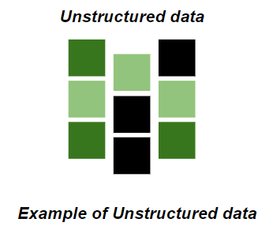
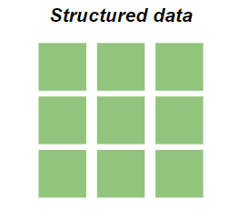

# Data Science

Data Science is a combination of multiple disciplines that uses statistics, data analysis, and machine learning to analyze data and extract knowledge and insights from it.

## What is Data Science?

Data Science is about data gathering, analysis, and decision-making.

It involves finding patterns in data through analysis to make future predictions.

By using Data Science, companies are able to make:

- **Better decisions** (e.g., should we choose A or B?)
- **Predictive analysis** (e.g., what will happen next?)
- **Pattern discoveries** (e.g., find patterns or hidden information in the data)

## How Does a Data Scientist Work?

A Data Scientist requires expertise in several areas:

- Machine Learning  
- Statistics  
- Programming (Python or R)  
- Mathematics  
- Databases  

Before finding patterns, a Data Scientist must organize the data in a standard format.

### Workflow of a Data Scientist

1. **Ask the right questions** – Understand the business problem.
2. **Explore and collect data** – From databases, web logs, customer feedback, etc.
3. **Extract the data** – Transform the data to a standardized format.
4. **Clean the data** – Remove erroneous values.
5. **Find and replace missing values** – Replace missing values with suitable ones (e.g., average).
6. **Normalize data** – Scale values to a practical range  
   _Example: 140 cm is smaller than 1.8 m, but numerically 140 > 1.8, so scaling is important._
7. **Analyze data** – Find patterns and make future predictions.
8. **Represent the result** – Present insights in a way the company can understand.

----

## What is Data?

Data is a collection of information.

One purpose of Data Science is to structure data, making it interpretable and easy to work with.

### Categories of Data

Data can be categorized into two groups:

- **Structured Data**  
  Organized and formatted data that fits into tables or databases (e.g., spreadsheets, SQL databases).

- **Unstructured Data**  
  Raw and unorganized data that doesn't follow a predefined format (e.g., text documents, images, videos).

### Unstructured Data
Unstructured data is not organized. We must organize the data for analysis purposes.

### Structured Data
Structured data is organized and easier to work with.

## How to Structure Data?
We can use an array or a database table to structure or present data.

Example of an array:

[80, 85, 90, 95, 100, 105, 110, 115, 120, 125]

The following example shows how to create an array in Python:

## Python
Python is a programming language widely used by Data Scientists.

Python has in-built mathematical libraries and functions, making it easier to calculate mathematical problems and to perform data analysis.

We will provide practical examples using Python.

To learn more about Python, please visit our Python Tutorial.

### Python Libraries
Python has libraries with large collections of mathematical functions and analytical tools.

In this tutorial, we will use the following libraries:

- [Pandas](EDA/pandas.ipynb) - This library is used for structured data operations, like import CSV files, create dataframes, and data preparation

- [Numpy]() - This is a mathematical library. Has a powerful N-dimensional array object, linear algebra, Fourier transform, etc.

- [Matplotlib]() - This library is used for visualization of data.

- [SciPy]() - This library has linear algebra modules